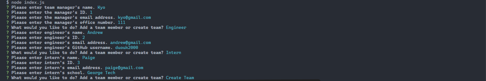
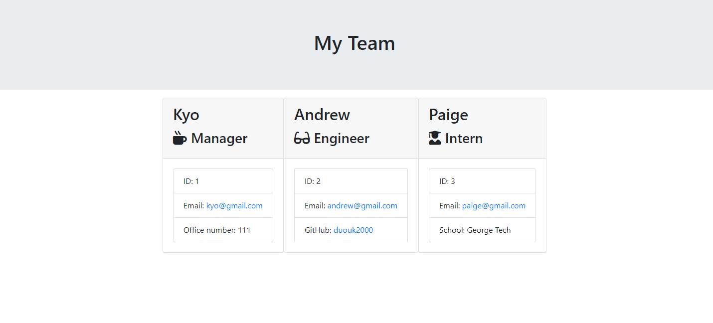
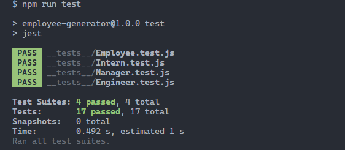

# Employee-Generator

generate a a HTML page with cards of employee details

## Description

This project is OOP (object oriented programming) with TDD (test driven development) in mind. This team members profile generator is designed to take the user's input and streamline it to generate the teams profile onto a HTML webpage.

[GitHub page](https://github.com/Digita1Panda/employee-generator)

[Employee/Team Profile Generator](https://digita1panda.github.io/employee-generator/)

## Table of Contents

- [Employee-Generator](#employee-generator)
  - [Description](#description)
  - [Table of Contents](#table-of-contents)
  - [Installation](#installation)
  - [Usage](#usage)
  - [License](#license)
  - [Features](#features)
  - [Tests](#tests)
  - [Badges](#badges)

## Installation

[Node.js](https://nodejs.org/en)

- Visit the Node website and install it.
- Once installed, right click on the JavaScript file named index.js and select "Open in integrated terminal".

- Initialize the project by going into the terminal and typing:

  ```
  npm init -y
  ```

- Install inquirer by typing in the terminal:

  ```
  npm i inquirer@6.5.0
  ```

- Install Jest for running the test by:

  ```
  npm i -D Jest
  ```

- Go to the package.json file and update the "scripts": {
  "test":
  }, section to:

  ```bash
  "scripts": {
  "test": "jest"
  },
  ```

- After you have completed the questions it will generate a team profile HTML file in the output folder.

## Usage

- Type in:

  ```
  Node index.js in the terminal.
  ```

- It will start asking you a series of questions, please answer them to the fullest.





## License

[](https://opensource.org/licenses/MIT)

MIT License

Copyright & All rights Reserved (c) 2023 Kwok Law

Permission is hereby granted, free of charge, to any person obtaining a copy of this software and associated documentation files (the “Software”), to deal in the Software without restriction, including without limitation the rights to use, copy, modify, merge, publish, distribute, sublicense, and/or sell copies of the Software, and to permit persons to whom the Software is furnished to do so, subject to the following conditions:

The above copyright notice and this permission notice shall be included in all copies or substantial portions of the Software.

THE SOFTWARE IS PROVIDED “AS IS”, WITHOUT WARRANTY OF ANY KIND, EXPRESS OR IMPLIED, INCLUDING BUT NOT LIMITED TO THE WARRANTIES OF MERCHANTABILITY, FITNESS FOR A PARTICULAR PURPOSE AND NONINFRINGEMENT. IN NO EVENT SHALL THE AUTHORS OR COPYRIGHT HOLDERS BE LIABLE FOR ANY CLAIM, DAMAGES OR OTHER LIABILITY, WHETHER IN AN ACTION OF CONTRACT, TORT OR OTHERWISE, ARISING FROM, OUT OF OR IN CONNECTION WITH THE SOFTWARE OR THE USE OR OTHER DEALINGS IN THE SOFTWARE.

---

## Features

Generating employee/team profile file.

## Tests

To run Jest tests, execute the following command in the terminal:

```bash
  npm run test
```



## Badges


Copyright © 2023 K.Law All Rights Reserved.
